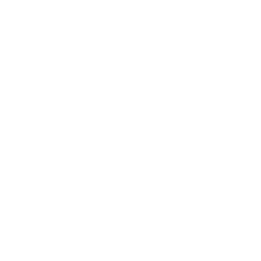

 

---
# Far-FroMM-HoMMe

Far-FroMM-HoMMe is a "Multimedia Museum Meta Mirror" project of the digital exhibtion Far From Home. It was created from the course Information Modelling and Web Technologies for the 2024/2025 academic year, with [Professor Fabio Vitali](https://www.unibo.it/sitoweb/fabio.vitali/en), for the Master's degree of Digital Humanities and Digital Knowledge at the University of Bologna. 

The exhibtion explores the different ways we understand the concept of home, how we find it and how we can lose it, through a collecton of 20 artworks from a variety of art institutions and museums from all over the world. 

---

## 👥 Contributors
- [Anouk Flinkert](https://github.com/digitalctrlv)
- [Regina Manyara](https://github.com/ValkyrieCain9)
- [Shiho Nakamura](https://github.com/shiho1000)
